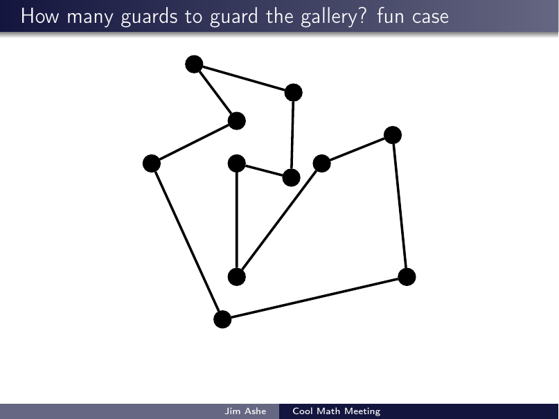

# Expository Talks — Mathematics for General Audiences

Slide decks from talks I gave for general audiences — university faculty seminars,
student outreach events, and IT-college colloquia. Unlike the [research talks](../research/),
these assume little or no mathematical background: the goal is to take a genuinely deep
piece of mathematics (rigidity theory, computational geometry, discrete conformal
geometry, Cantor's infinities) and make it land in under an hour.

All decks are LaTeX/Beamer with heavy use of stepwise overlays — arguments unfold
visually, one move at a time. The animated GIFs below are rendered directly from
those overlay sequences, so they show the slides exactly as an audience saw them.

| Talk | Topic | Materials |
|---|---|---|
| [Cauchy's Rigidity Theorem](cauchy-rigidity-theorem/) | Why a convex polyhedron cannot flex — a 200-year-old proof with a famous bug in it. | [PDF](cauchy-rigidity-theorem/cauchy-rigidity-theorem.pdf) · [source](cauchy-rigidity-theorem/latex-source/) |
| [The Art Gallery Problem](art-gallery-problem/) | How many guards does a gallery need? Fisk's celebrated one-slide proof. | [PDF](art-gallery-problem/art-gallery-problem.pdf) · [source](art-gallery-problem/latex-source/) |
| [Circle Packing: A Visual Introduction](circle-packing/) | An accessible tour of my research area — from tangent circles to discrete analytic functions. | [PDF](circle-packing/circle-packing.pdf) · [source](circle-packing/latex-source/) |
| [What is a Proof? …What is Math?](what-is-a-proof-what-is-math/) | Proof, infinity, and Cantor's diagonal argument for an IT audience (2025). | [PDF](what-is-a-proof-what-is-math/what-is-a-proof-what-is-math.pdf) · [source](what-is-a-proof-what-is-math/latex-source/) |

## A taste

Fisk's proof of the Art Gallery Theorem, exactly as presented — triangulate the
gallery, 3-color the triangulation, and post guards at the least-used color:

Each talk folder contains more animations like this, the full PDF deck, and the
complete, self-contained LaTeX/Beamer source (each `latex-source/` folder compiles
standalone with two passes of `pdflatex`).
