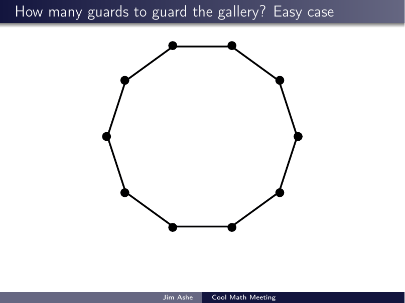

# The Art Gallery Problem

*General-audience talk, WGU IT College "Cool Math Meeting" faculty seminar.*

**The question (Klee, 1973):** an art gallery is a polygon with $n$ walls; a guard
sees everything in straight lines around them. How many guards are always enough?

Chvátal answered in 1975 — $\lfloor n/3 \rfloor$ guards always suffice, and are
sometimes necessary — with a somewhat involved induction. The heart of this short
talk is **Fisk's 1978 proof**, which fits on one slide: triangulate the polygon,
3-color the triangulation's vertices, and place guards on the least-used color.

**Full deck:** [`art-gallery-problem.pdf`](art-gallery-problem.pdf)

## Highlights

The easy case — a convex gallery needs exactly one guard:

The fun case — Chvátal's original argument, then Fisk's triangulation +
3-coloring proof:

## References

- V. Chvátal, *A combinatorial theorem in plane geometry*, J. Combin. Theory Ser. B 18 (1975) 39–41. [doi:10.1016/0095-8956(75)90061-1](https://doi.org/10.1016/0095-8956(75)90061-1)
- S. Fisk, *A short proof of Chvátal's watchman theorem*, J. Combin. Theory Ser. B 24 (1978) 374.

## Source

[`latex-source/`](latex-source/) is self-contained (Beamer + TikZ; the gallery,
triangulation, and coloring are all drawn in TikZ with overlays). Compile with two
passes of `pdflatex art_gallery_problem.tex`.
