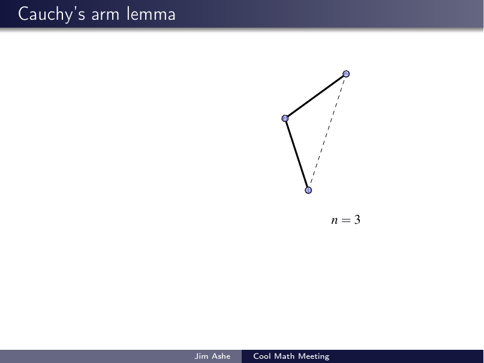
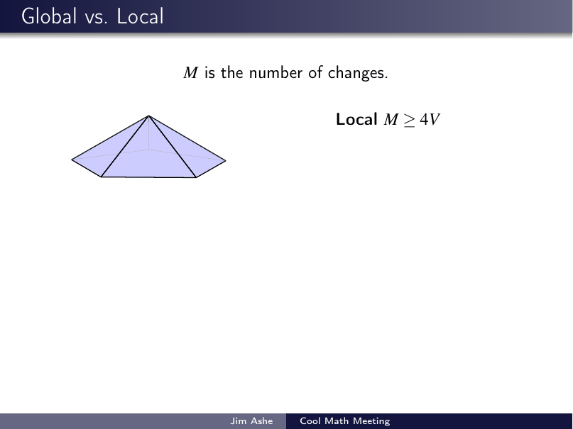

# Cauchy's Rigidity Theorem

*General-audience talk, WGU IT College "Cool Math Meeting" faculty seminar.*

**The claim:** two convex polyhedra with the same faces, attached the same way, are
congruent — a convex polyhedron cannot flex. Cauchy proved it in 1813, allegedly
prompted by Legendre. The talk follows the classic proof (as in *Proofs from THE BOOK*):

1. **Local:** at each vertex, compare the two polyhedra and mark edges where the
   dihedral angle increases or decreases; **Cauchy's arm lemma** forces at least
   four sign changes around any marked vertex.
2. **Global:** a counting argument on the sign-change graph (via Euler's formula)
   shows so many sign changes are impossible — so no angle changed at all.

The talk also tells the story *around* the proof: the arm lemma's famous flaw that
survived a century until Steinitz repaired it, and what happens when you drop
convexity — Connelly's flexible polyhedron and the Bellows Conjecture.

**Full deck:** [`cauchy-rigidity-theorem.pdf`](cauchy-rigidity-theorem.pdf)

## Highlights

Cauchy's arm lemma — opening the hinges of a convex polygonal arm only pushes its
endpoints farther apart:

The finale — the global count against the local bound:

## Source

[`latex-source/`](latex-source/) is self-contained (Beamer + TikZ figures; the
polyhedron figures are pre-rendered from TikZ). Compile with two passes of
`pdflatex cauchy_rigidity_theorem.tex`.
