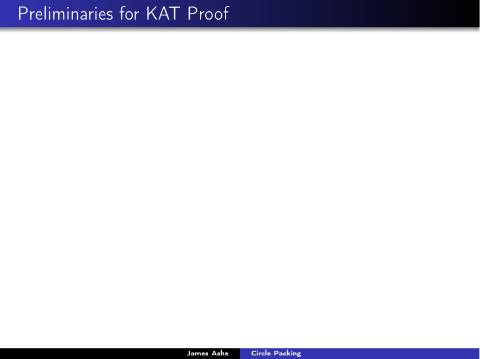
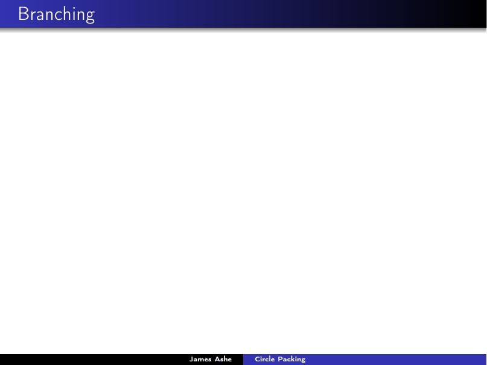

# Circle Packing: A Visual Introduction

*Expository colloquium-style talk, Western Governors University.*

An accessible tour of my research area, [circle packing](../../research/) — built to
be followed with almost no prerequisites, because nearly every idea is shown as a
picture. The arc:

1. **What is a circle packing?** Tangency patterns, flowers, and where packings live
   (Euclidean, hyperbolic, and spherical geometry).
2. **The Koebe–Andreev–Thurston theorem** — every triangulation is realized by a
   packing, with a visual proof sketch via the packing algorithm.
3. **Discrete analytic functions** — maps between packings, a discrete Riemann
   Mapping Theorem, and why "discrete" here is not an approximation but a theory.
4. **Branching** — the discrete analogue of $z \mapsto z^k$, leading to my research
   on generalized branching, and an application to the
   [Thomson problem](../../thomson-problem/).

**Full deck:** [`circle-packing.pdf`](circle-packing.pdf)

## Highlights

Why a flower of circles closes up — the angle-sum condition behind the KAT theorem:

Branching in action — an animated sequence (rendered live in Ken Stephenson's
*CirclePack* software) deforming a packing through a generalized branch point:

## Source

[`latex-source/`](latex-source/) contains the Beamer source and every referenced
image (including the frame-by-frame *CirclePack* screenshots that drive the
animations). Compile with two passes of `pdflatex circle_packing.tex` — the few
`.eps` figures are converted automatically by TeX Live's `epstopdf`.
