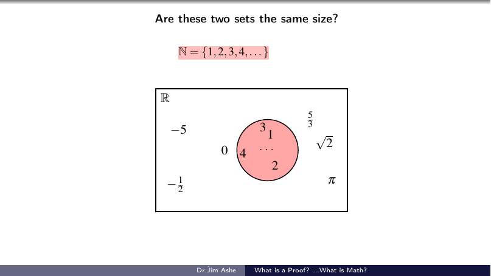
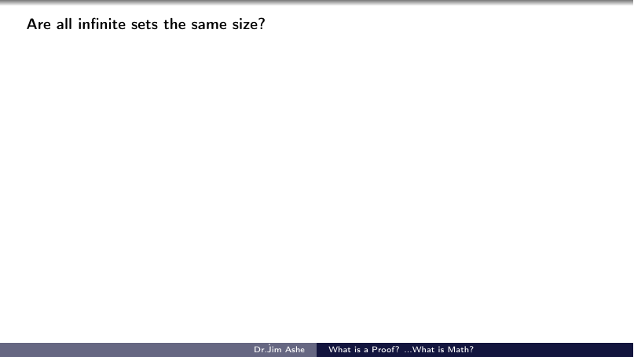

# What is a Proof? …What is Math?

*Outreach talk for a Women-in-IT audience, WGU IT College, 2025.*
*Subtitle: "A 'fun' introduction to the maths you didn't know you loved."*

A talk for smart people who don't think of themselves as math people. Starting from
"what actually *is* a proof?", it walks a non-math audience all the way to one of
the most beautiful arguments ever found — that some infinities are bigger than
others:

- What mathematicians actually do (it isn't arithmetic).
- Proof as an *idea made airtight* — with small, complete examples.
- Are there more rationals than naturals? No — and here's the zig-zag enumeration.
- Are there more reals? **Yes** — Cantor's diagonal argument, step by step.

**Full deck:** [`what-is-a-proof-what-is-math.pdf`](what-is-a-proof-what-is-math.pdf)
(a short video clip played during the live talk is linked, not embedded).

## Highlights

The rationals are countable — Cantor's zig-zag enumeration:

The diagonal argument — building a real number that escapes every list:

## Source

[`latex-source/`](latex-source/) contains the modular Beamer source and all
images: `what_is_math_MAIN.tex` inputs `part_1b.tex` through `part_4.tex`
(`part_1.tex` and `part_5.tex` are earlier/optional sections, kept but not
compiled into the deck). Compile with two passes of
`pdflatex what_is_math_MAIN.tex`.
